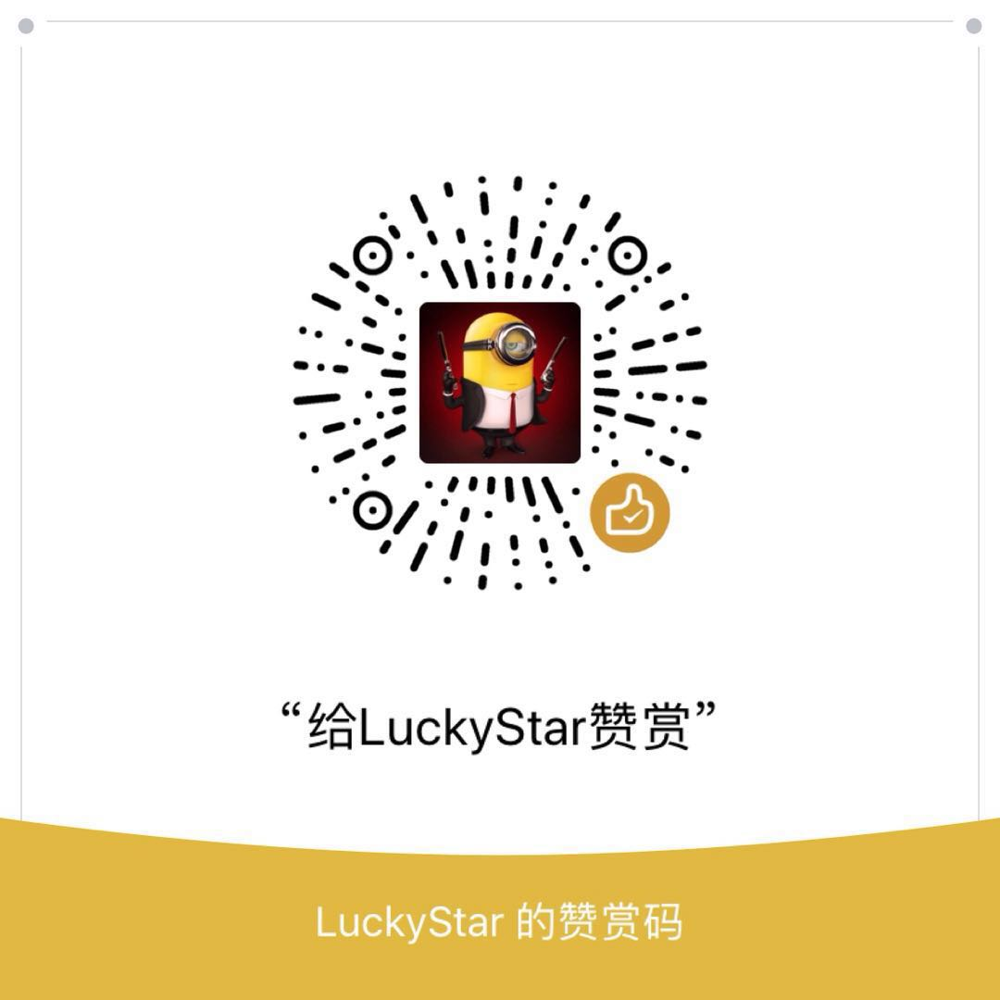

### [《精通比特币（第二版）-- 区块链编程》](https://bitcoinbook.info/) 中文版
### [Mastering Bitcoin 2nd Edition - Programming the Open Blockchain]( https://bitcoinbook.info/ ) in Chinese (Simplified)

本书主要面向开发人员，前两章对比特币的介绍也适用于非开发人员。任何对技术有基本了解的人都可以阅读前两章，以深入了解比特币。

### 目录

[前言](前言.asciidoc)

[术语](术语.asciidoc)

[第一章 概述](第一章.asciidoc)

[第二章 比特币如何运作](第二章.asciidoc)

[第三章 Bitcoin Core参考实现](第三章.asciidoc)

[第四章 密钥和地址](第四章.asciidoc)

[第五章 钱包](第五章.asciidoc)

[第六章 交易](第六章.asciidoc)

[第七章 高级交易和脚本](第七章.asciidoc)

[第八章 比特币网络](第八章.asciidoc)

[第九章 区块链](第九章.asciidoc)

[第十章 挖矿和共识](第十章.asciidoc)

[第十一章 比特币安全](第十一章.asciidoc)

[第十二章 区块链应用](第十二章.asciidoc)

### 原书购买链接：
[Amazon](https://www.amazon.com/Mastering-Bitcoin-Programming-Open-Blockchain/dp/1491954388)

### 关于译者
互联网从业者，对经济学感兴趣，很早加入数字货币和区块链研究。

闲暇时间翻译，欢迎指正，感谢加星~

[下一章：前言](前言.asciidoc)
### 打赏

